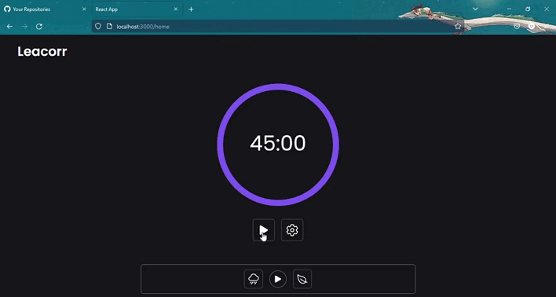

# Leacorr (Timer) 

A **React** project using **Tailwind** and a **library for the progress bar**.

Timer for time control. Set the right time in the settings and time for rest and practice as much as you want.
You can turn on the Lo-Fi Radio and various sounds for more comfortable work. The project is uploaded to 
**Vercel**.

You can download this project and use it. In the project directory, you can run:

### `npm start`
### `npm run build`